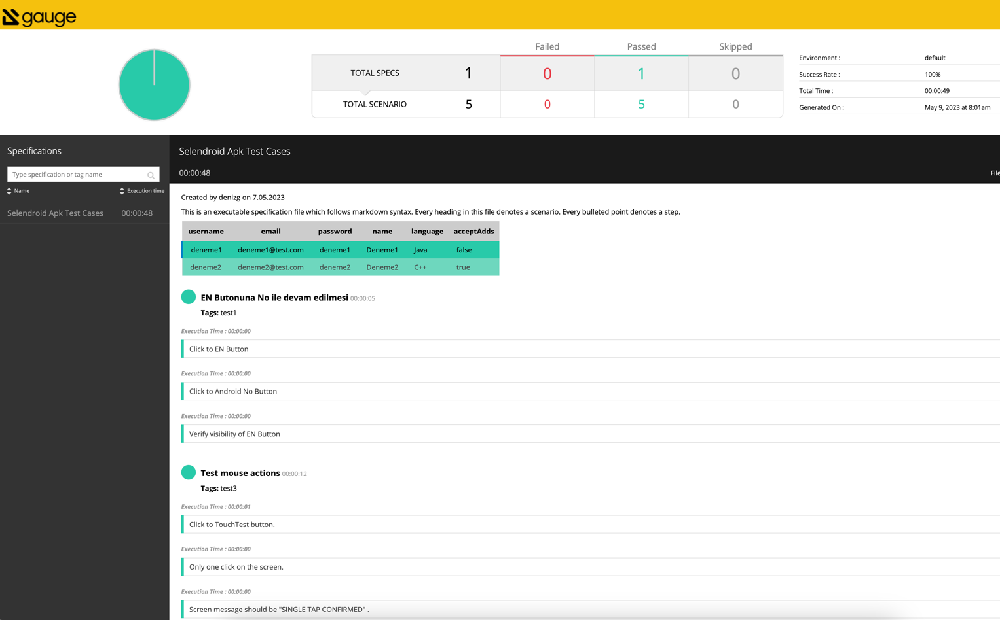

## Gauge Kütüphanesi İle Mobil Test Otomasyonu
## Test Senaryoları

1. EN butonuna basıldığında çıkan "No,no" mesajına basılarak devam edildiğinde mesajın kaybolması ve ana ekrana geri dönüldüğü kontrol edilir.
2. "Register a new user" butonu ile açılan ekran aracılığı ile 4 tane kullanıcı ekleme. Kullanıcı bilgileri girildikten sonra doğrulama ekranında doğruluğu yapılmalı. Kullanıcı bilgileri `RegisterUserData.csv` dosyasından okutulacak.
3. "Touch Actions" butonuna basılarak açılan ekranda click ve long press yapıldığında ekranda çıkan mesajların doğruluğu kontrol edilecek.
4. "Display text view" butonuna tıklandıktan sonra çıkan "Text is sometimes displayed" mesajı kontrol edilir.

## Test Altyapısı
Test kodları appium kütüphanesi kullanılarak java programlama dili ile kodlanmıştır. Base.java dosyasında testi yapılacak uygulamanın açılması için gerekli bilgiler(capabilities) ve Android/iOS ayrımı yapılmıştır.

`protected Boolean android = true;`

parametresi ile default android olacak şekilde belirlenen ortamda testler koşulacaktır. Parametre false yapılır ise testler iOS uygulama üzerinde koşulacaktır. Selendroid uygulamasının iOS app'i olmadığı için gerçek test yapılamamıştır ama her iki uygulamdaki elementlerin yer belirleyicileri (locators) aynı olduğunda testlerin çalışması gerekir.

Steps.java dosyasında benzer kullanılan metodlar ve test adımları kodlanmıştır. Test adımları Gauge kütüphanesinin `@Step("Step definition")` anotasyonu ile belirlenmektedir. Step ile tanımlanan metodlar test.spec dosyası içinde çağrılarak test senaryoları oluşturulmuştur. Gauge kurulumu ve detaylar için [bu adresi](https://gauge.org/) ziyaret edebilirsiniz. Test kodlarının başarılı bir şekilde çalışması için gerekli olan gereksinimler `pom.xml` dosyasında belirtilmiştir.

Gauge ile yazılan tek bir test senaryosunu çalıştırmak için;

`mvn gauge:execute -DspecsDir=specs -Dscenario="Test mouse actions"`

Eğer tüm senaryolar çalıştırılacak ise aşağıdaki şekilde çalıştırılmalıdır.

`mvn gauge:execute -DspecsDir=specs`

Komut çalıştırıldıktan sonra test.specs dosyasında senaryolar sırası ile çalışır. Test sonuçlarına reports/html-report/index.html sayfasından ulaşılabilir. Örnek rapor ekran görüntüsü aşağıdaki gibidir. Bu rapor Gauge kütüphanesinin kendi oluşturduğu bir rapordur.

2 numaralı senaryoda test datasını `RegisterUserData.csv` dosyasından okuma işi, Gauge kütüphanesinin kullanılarak yapılmıştır. CSV dosyasındaki bilgiler her girdi olarak hemde doğrulama işleminde kullanılmıştır.

_**NOT**: Selendroid uygulaması test koşulacak cihazda kurulu olduğu varsayılarak kodlanmıştır. Eğer uygulama her defasında yüklenerek test koşumu yapılacak ise Base.java içindeki capabiliy değiştirilmelidir._